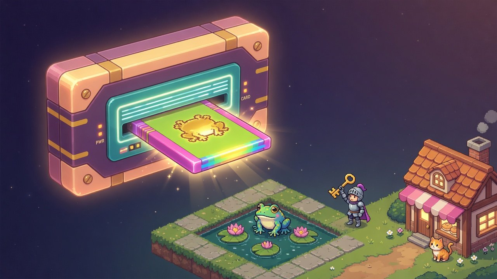
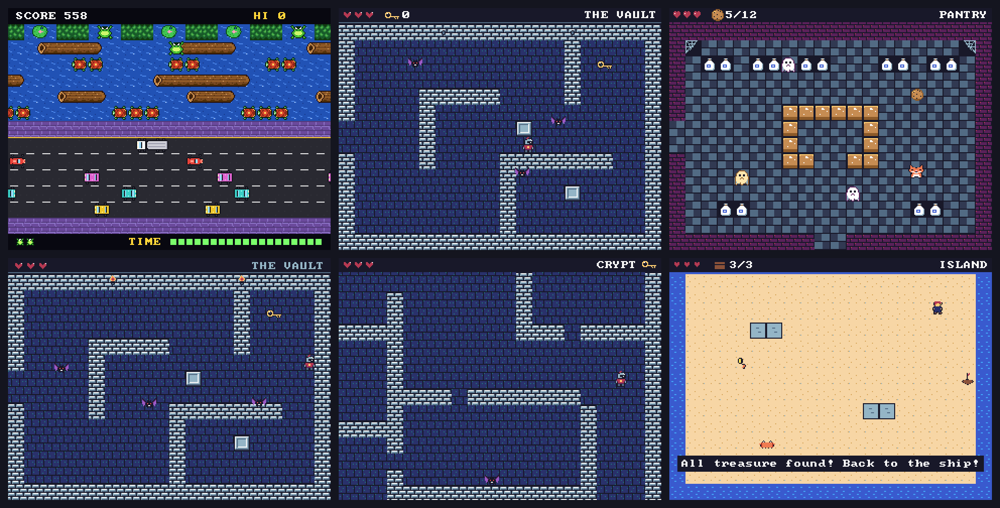

<p align="center">
  
</p>

<h1 align="center">Kartu</h1>

<p align="center">
  <strong>A 16-bit fantasy console designed to be programmed by AI — and by you.</strong><br>
  Small, deterministic, text-native. Describe a game; an agent builds it, plays it, and proves it can be won.
</p>

<p align="center">
  <a href="https://github.com/niconistal/kartu/actions/workflows/ci.yml"></a>
  <a href="https://github.com/niconistal/kartu/releases"></a>
  <a href="#licence"></a>
  <a href="https://niconistal.github.io/kartu/"></a>
  <a href="https://niconistal.github.io/kartu/play/"></a>
</p>

<p align="center">
  <a href="https://niconistal.github.io/kartu/">Website</a> ·
  <a href="https://niconistal.github.io/kartu/play/">Play the carts</a> ·
  <a href="docs/README.md">Documentation</a> ·
  <a href="API.md">API reference</a> ·
  <a href="CONTRIBUTING.md">Contributing</a>
</p>

---

Kartu is a fantasy console in the tradition of PICO-8 and TIC-80: a small imaginary machine
with hard limits, so that games stay small, finishable and coherent. The difference is *who*
it was designed for. Every part of Kartu — the asset format, the runner, the test loop — was
shaped so that a language model can write a game, look at it, and check that it works,
using the same tools a person would.

- **320×240, 60 fps**, 4 tile layers, 128 sprites, 512 colours in palette RAM, 8×8 text
- **Lua 5.4** in a sandbox with a per-frame instruction budget: a runaway loop is an on-screen error, not a hang
- **Text-native assets**: sprites, tiles, maps, palettes, instruments and songs are plain text in one `assets.cw` file
- **Deterministic**: same seed + same inputs ⇒ bit-identical frames and audio on x86, ARM and WebAssembly
- **A headless runner with bots**: screenshots, state dumps, replay scripts and goal bots that prove a cart is winnable
- **One core, every screen**: the browser, your desktop, and ARM retro handhelds (Miyoo Mini today)

<p align="center">
  
  <br><sub>The starter carts, straight from the runner. <a href="https://niconistal.github.io/kartu/play/">Play them in your browser.</a></sub>
</p>

## Quick start

```sh
curl -fsSL https://raw.githubusercontent.com/niconistal/kartu/main/install.sh | sh
kartu new frog-quest && cd frog-quest
claude          # or any agent with a shell: "make this a game where a frog hops across lily pads to eat 5 flies"
kartu web .     # play it
```

`kartu new` writes a small working game plus everything an AI needs to change it: `AGENTS.md`
(how to make a Kartu game), `CLAUDE.md`, `bot.txt` (the plan a bot follows to prove the game
can be won) and `.mcp.json` (the maker tools). Any agent with a shell can drive the `kartu`
commands; Claude Code also gets them as MCP tools and a skill (`kartu setup`).

Prefer to write it yourself? A cart is two text files. Open `main.lua` and `assets.cw`,
run `kartu check .`, and `kartu web .` reloads on refresh.

> Prebuilt binaries are Linux x86_64 for now. Elsewhere: `cargo install --git https://github.com/niconistal/kartu kartu kartu-maker`
> (Rust 1.85+). See [Getting started](docs/getting-started.md).

## Why Kartu

PICO-8 proved that a small, opinionated console is a wonderful place to make games. Its
constraints were chosen for people who enjoy them, and several of those constraints get in
the way of a language model:

| | A console built for people | Kartu |
|---|---|---|
| Code limit | token cap ⇒ golfed, minified code (where models make mistakes) | limit **runtime** (instructions per frame, 32 MB), not source size |
| Assets | sprites, maps and music as hex blobs in a binary cart | text grids, ASCII maps, music notation: readable, diffable, patchable |
| Testing | a human plays it | a deterministic headless runner with screenshots, state dumps, replays and goal bots |
| Errors | a crash, somewhere | every error names its file and line; `kartu check` lists all of them at once |
| Culture | hand-crafted, code-golf | AI-welcome from day one; the prompt can ship with the cart |

The idea in one line: **constraints are good for AI**, because they keep scope small, games
finishable and the look coherent — *as long as they are constraints an AI can read and test
against.* Kartu is our attempt to build exactly that set of constraints, and to give it away.

## What a cart looks like

A cart is a folder with two files. Here is a whole one:

<table>
<tr><th><code>assets.cw</code></th><th><code>main.lua</code></th></tr>
<tr><td>

```text
palette p
  . clear
  w #f4f4f4
  y #ffcd75
sprite star 8x8 pal=p
...yy...
...yy...
yyyyyyyy
.yyyyyy.
..yyyy..
.yy..yy.
yy....yy
........
```

</td><td>

```lua
x = 156
function update()
  if btn("left")  then x = x - 2 end
  if btn("right") then x = x + 2 end
end
function draw()
  text("HELLO, KARTU", 112, 40, "w")
  spr("star", x, 116)
end
```

</td></tr>
</table>

Maps are pictures too. Legends bind characters to tiles, and `@` markers place the hero,
enemies and pickups right in the map, where a reader (human or model) can see the level:

```text
map hall 20x15
legend # wall  T torch  o block  E door  . floor
legend P @hero:floor  B @bat:floor  K @key:floor
####T####E####T#####
#..................#
#...o..........o...#
#.....P.............
#..........B.......#
####################
```

### Kits: a whole game from one table

A **kit** is a genre library built into the console. The top-down kit turns a config table
into a complete Zelda-like: rooms, hero, enemies, pickups, locked doors, dialogue, HUD, title
and win screens, sound. This is the entire `main.lua` of the *Dungeon* cart above:

```lua
local td = kit("topdown")
td.setup {
  title = "DUNGEON",
  intro = "The key is somewhere east. Bring it back to the door in the hall.",
  rooms = { { "hall", "gallery", "vault" } },
  hero = { spr = "knight1", walk = "knight_walk", speed = 1.5, hp = 3 },
  attack = { btn = "a", spr = "sword", spr_v = "swordv" },
  enemies = { bat = { spr = "bat_fly", move = "chase", speed = 0.8, hp = 1, drop = "heart" } },
  pickups = { key = { spr = "key", toast = "You found the key!" }, heart = { spr = "heart", heal = 1 } },
  doors = { door = { needs = "key", opens = "dooropen", locked = "Locked! Find the key." } },
  win = "flag:exit",
  hud = { hearts = { "heart", "heart0" }, show = { "key" } },
  music = { title = "adventure", play = "cave", win = "victory" },
}
function update() td.update() end
function draw() td.draw() end
```

Kits run as ordinary cart code, so anything a kit does you can also do by hand — and you can
mix both.

### Prove it can be won

Every starter cart ships with a `bot.txt`: a plan in plain words. The goal bot reads the live
tile map, path-finds, and works out the buttons frame by frame. `kartu playtest` runs it on
three seeds and refuses to pass a game that can't be finished or that hits the player unfairly.

```text
# dungeon/bot.txt
hero world.hero
fight world.enemies a 30
tap a
wait until world.state == "play"
goto tile 19,8
hold right 16
wait until world.room == "gallery"
…
goto flag door
goto flag exit
```

```
$ kartu playtest carts/dungeon
playtest PASS: the bot won on every seed, no unfair hits
seed 1: WON at f1409 (23.5 s)
seed 2: WON at f1426 (23.8 s)
seed 3: WON at f1412 (23.5 s)
```

Because the console is deterministic, that result is the same on your laptop, in the browser
and on a handheld — and a human playthrough recorded in the web player replays natively with
the same frame hash.

## Works with any AI

Kartu meets agents at three levels, and the lowest one is never broken:

1. **CLI** — `kartu check`, `run`, `playtest` print plain text and exit codes. Any agent with a shell can use them.
2. **`AGENTS.md`** — `kartu new` drops a guide into every cart: small steps, look at screenshots, write the bot plan, playtest before saying "done". `CLAUDE.md` points at it.
3. **MCP** — `kartu mcp` serves the same tools over the Model Context Protocol, with screenshots returned as images. `kartu setup` connects Claude Code.

See [Making a game with an AI](docs/making-a-game.md) and [The maker tools](docs/ai-tools.md).

## The console at a glance

| | |
|---|---|
| Display | 320 × 240, 60 fps, fixed timestep (an exact ×2 on 640 × 480 handheld panels) |
| Colour | 15-bit master colours; 16 background + 16 sprite palettes × 16 entries (512-colour CRAM); palette swaps and recolours |
| Background | 4 tile layers, 16 × 16 tiles, wrap + per-layer scroll, camera with clamp, `bg.fixed` for HUD layers |
| Sprites | 128 per frame, up to 64 px, flip, palette override, per-layer depth; named animation clips |
| Text | 8 × 8 font (public-domain font8x8), alignment, word-wrap, boxes, shadow, scale ×1–4 |
| Sound | 8-voice synth at 24 kHz: square/triangle/saw/sine/noise/pluck/FM, ADSR, vibrato, slide, lowpass; MML songs; 29 instruments, 21 sfx and 5 songs built in |
| Input | D-pad, A B X Y, L R, Start, Select — nothing else, so everything plays everywhere |
| Code | Lua 5.4; no `io`/`os`/`load`/`require`; 32 MB heap; ~4 M instructions per frame |
| World | `move` with wall sliding, `overlap`, hit boxes, tile flags, spawn markers |
| Determinism | seeded `rnd`, no clock, polynomial `sin`/`cos`; frame and audio hashes match on x86, ARM and WASM |
| Cart | a folder: `main.lua` + `assets.cw` (+ `bot.txt`, `kartu.toml`) |

Full reference: [API.md](API.md) · in-depth guides: [docs/](docs/README.md)

## Repository

| path | crate | licence | what |
|---|---|---|---|
| [`core/`](core/) | `kartu-core` | MIT | the console: picture unit, text-native assets, synth, Lua VM + API, kits. No window, no audio device, no files: a library any host can embed |
| [`player/`](player/) | `kartu` | MIT | the runner (`check`, `run`, bots, `playtest`), art import, framebuffer + OSS player for handhelds, and the WebAssembly web player |
| [`maker/`](maker/) | `kartu-maker` | AGPL-3.0 | `kartu-mcp` and the `new`/`setup`/`web`/… commands, cart templates, the `AGENTS.md` skill |
| [`carts/`](carts/) | | MIT | the starter carts, which are also the starter art library |
| [`web/`](web/) · [`miyoo/`](miyoo/) | | MIT | the browser player page · the Onion OS app and Games-tab console |
| [`docs/`](docs/) · [`site/`](site/) | | | guides and the website source |

## Status

Kartu is **v0.1**: young, working, and still soft in places. What's here has been used to
build dozens of small games by agents and by hand; the API is stable enough to write to and
young enough to shape. Things we know we want next, in the core alone:

- more kits (platformer, shoot-'em-up) and better defaults in the top-down kit
- per-line scroll, 8×8 tiles, autotiles, a `.cart.png` single-file format
- macOS and Windows builds, more handhelds (Anbernic, Trimui), a desktop window player
- publishing `kartu-core` to crates.io

We deliberately keep this repository about the **console and its tools**. Anything built on
top of it belongs in its own home.

## Contributing

Kartu is open source because a console is only worth as much as the games and tools people
make for it. The best time to shape one is now, while it is small. Ways in:

- **Play the carts, break them, tell us** — [open an issue](https://github.com/niconistal/kartu/issues/new/choose). A confusing error message is a bug.
- **Make a cart** — by hand or with your favourite agent, then send it. Small and polished beats big and broken.
- **Point an AI at it** — the tool that trips a model up is the one we most want to hear about; the docs are written to be read by models too.
- **Improve the core** — a kit, a synth wave, a smarter bot, a port to a new handheld or a desktop window.
- **Write** — a guide, a fix to a sentence that didn't make sense, a translation.

[CONTRIBUTING.md](CONTRIBUTING.md) has the workflow (it's short: `cargo test`, `scripts/verify-carts.sh`, a pull request).
Please be kind: we follow the [Contributor Covenant](CODE_OF_CONDUCT.md).

## Licence

- `kartu-core`, the `kartu` player, the carts, the web player and the handheld app: **MIT** ([LICENSE](LICENSE))
- `kartu-maker` (`kartu-mcp` and the maker commands): **AGPL-3.0** ([maker/LICENSE](maker/LICENSE))

Games you make with Kartu are yours. The built-in font is [font8x8](https://github.com/dhepper/font8x8)
(public domain); Lua is bundled through [mlua](https://github.com/mlua-rs/mlua) (MIT).

<p align="center"><sub><em>Kartu</em> means "card" in Indonesian and Malay. A cart is a card you slot in.</sub></p>
